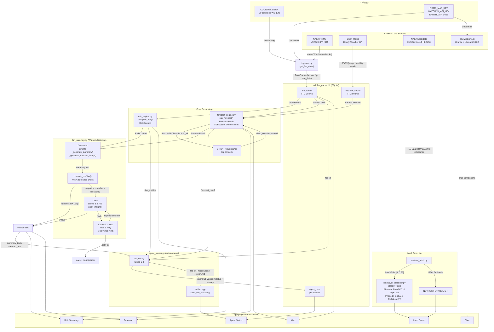

# Wildfire Dashboard AI

**🔴 Live demo:** https://kwgzjbgdsdyd9epjepovex.streamlit.app/

## Challenge Theme

**August Challenge Theme: Advance Space Exploration with AI**
> "Build AI-powered systems that advance space exploration by improving mission success, enabling smarter decisions, and making space more accessible and understandable."

This project addresses two of the three pillars directly:

- **Enabling smarter decisions** — the strongest fit. An XGBoost forecast with SHAP explainability, backed by a Granite/Llama guardrail-verified AI summary, converts raw satellite fire detections into structured, human-readable risk assessments with ranked feature contributions and an auditable confidence level — not just a map, but a reasoned decision-support output.
- **Making space more accessible and understandable** — NASA FIRMS fire detections and Sentinel-2/HLS imagery require domain expertise (orbital parameters, band indices, NRT latency constraints) to interpret in raw form. This project translates that data into plain-language risk summaries, an interactive map, and land-cover classifications a non-specialist field worker can act on.
- **Improving mission success** — this pillar does not apply in the literal sense: this project involves no spacecraft, orbital operations, or space mission planning. Honestly framed, it applies only at one remove: Earth-based field operations (ranger deployments, civil protection responses) that consume space-derived Earth observation data. That is the user group this project was built for.

##  The Problem

A heat point detected by satellite (NASA FIRMS) is just a coordinate with an
intensity number attached (FRP — Fire Radiative Power). On its own, that
signal **does not support a decision**:

- Is it a real fire, or a false positive (a hot metal roof, sun glint, a
  controlled industrial burn)?
- Does it fall on vegetation with dry fuel ready to spread, or on an
  already-harvested field with no real risk?
- Is the risk going to escalate in the next 24 hours because of dry weather
  and wind, or is it going to burn out on its own?
- How do you justify to a supervisor, a board, or an insurer why resources
  were (or weren't) deployed?

Today, a local expert fills that gap with fragmented maps and personal
judgment — slow, not scalable, with no auditable record, and entirely
dependent on that person being available and awake the exact moment the
signal appears.

##  Illustrative Case — Angola

*(An illustrative usage scenario, not a measured real-world deployment.
Angola is one of the ~20 countries covered by the system, and the only one
outside Europe with a computer-vision model fine-tuned on real regional
data — see the limitations noted below.)*

### Huambo, dry season — 6:40 AM

João has patrolled this area for twelve years. He carries a folded paper map
in his shirt pocket and an old tablet that sometimes catches a signal. This
morning, the tablet shows a red dot near the river, a 40-minute drive over
dirt roads that last week's rain left worse than usual.

He doesn't know what that dot is.

It could be a real fire, spreading right now through the dense vegetation
he watched grow thick this year from early rains. Or it could be a
controlled burn some farmer lit without telling anyone, the way it happens
every week this time of year. The satellite sensor doesn't tell the
difference — it just sees heat. Nobody at the regional office can tell him
either, because they're looking at the exact same map, with no more
context than he has.

João has three people available today. If he sends someone to the red dot
and it's a controlled burn, those hours of driving, fuel, and daylight
don't come back — and if a second dot shows up this afternoon, closer to a
community, he won't have anyone free to respond. If he sends no one and it
was a real fire, in six hours it could be a kilometers-long burn scar.

He has no way to know which scenario this is. He decides with the
experience he has, which is considerable, but it isn't data — it's a
trained hunch built from years of seeing things that looked similar, not
identical to this.

He sends someone. It's a farmer's controlled burn. The man hadn't even
realized his fire had shown up on a NASA satellite.

Three hours of driving, gone. And in the afternoon, a second dot does
appear — close to a village, in an area João knows well because it holds
dense woodland, the kind of vegetation that burns fast and unforgivingly in
dry season. By the time someone arrives, it's already been burning a while.
Nobody did anything wrong — nobody simply had the information in time to
choose correctly between the two dots from that morning.

---

### The same morning, with Wildfire Dashboard AI

The red dot near the river appears on João's screen at 6:41 AM — one minute
after the satellite detected it. But this time it isn't just a dot.

Underneath, in plain language, it reads:

> *Cropland detected in this area (72% confidence). Low NDVI (0.18) —
> consistent with already-harvested cropland, not dense forest. Spread
> risk: LOW. Recommendation: monitor, low field-verification priority.*

And a second point — the one that, in the earlier story, only appeared in
the afternoon — is already visible early in the 24-hour forecast, because
the system doesn't wait for the fire to start; it computes risk per grid
cell using weather, humidity, and local fire history:

> *Risk: EXTREME. Forest_Vegetation confirmed, NDVI 0.71 (dense, likely dry
> vegetation). 24h relative humidity: 18% — the strongest contributing
> factor in this calculation. Recommendation: prioritize field
> verification.*

João doesn't have to guess between the two dots. The system already made
the comparison for him, with data, in seconds. He sends his people straight
to the second point — the one that arrived too late in the other story.
This time, they get there with daylight to spare.

The river dot, the farmer's burn, stays logged and monitored, without
spending the one mobile resource João had that morning.

---

**The difference isn't the satellite — the satellite already existed.** The
difference is that João, in the second scenario, doesn't have to decide on
a trained hunch — he decides on a verified number, generated in the time it
takes to pour a cup of coffee.

*(This is an illustrative scenario to explain the usage flow — João is a
fictional character, not a measured real-world deployment. What is real:
the land-cover classification, NDVI computation, SHAP-based risk forecast,
and AI-verified summary are built and tested capabilities using real
satellite data, documented in JUDGE.md — including their known limits.)*


##  What does it do?
Wildfire Dashboard AI is a real-time wildfire intelligence dashboard built on real satellite
Earth-observation data. It ingests live NASA FIRMS fire detections (VIIRS/MODIS),
plots them on an interactive Leaflet map with clustering (CARTO/OSM tiles) across
~20 high-risk countries, and runs a 24-hour risk forecast over a 0.25° grid using
an XGBoost classifier with SHAP explainability (with a deterministic fallback when
fire activity is too sparse for a stable model). A computer-vision pipeline —
MobileNetV2 fine-tuned on real Sentinel-2/HLS satellite imagery via NASA Earthdata —
classifies land cover (forest, cropland, water, built-up, bare, wetland) and
computes NDVI, giving every fire detection real vegetation context instead of a
bare coordinate. A generator–critic agent pair (IBM Granite generates plain-language
risk summaries; a second LLM critic audits every number against the source data
before it reaches the user) turns the raw numbers into verified, human-readable
intelligence, backed by a contextual chat layer for follow-up questions. A fully
autonomous background agent (`agent_runner.py`) can run this entire pipeline
unattended on a schedule, producing a reproducible artifact bundle — dataset,
trained model, script, and report — for every run. Built for forest rangers, civil
protection agencies, and emergency managers who need actionable fire intelligence
at a glance.

---

## How Wildfire Dashboard AI maps to the judging criteria

| Criterion | How Wildfire Dashboard AI addresses it |
|---|---|
| **1. Technical Execution** | Every component runs against real data, not mocks: live NASA FIRMS ingestion, real Sentinel-2/HLS fetches via NASA Earthdata (authenticated, with a diagnosed-and-fixed network-reliability bug — see JUDGE.md), a real XGBoost model with SHAP explainability (not a black box), and two independently trained/validated computer-vision checkpoints (93.4% EuroSAT-10, 95.6%/74.6% Global-6 EuroSAT/Angola splits) with root-cause-documented bug fixes for every misclassification found during testing. |
| **2. Innovation** | A generator–critic (Guardrails) agent pair audits every AI-generated claim against source data before it reaches the user, with a live `?debug=guardrails` mode to demonstrate the audit loop catching a fabricated number in real time. The land-cover model uses a source-aware weighted sampling strategy to correct a real domain-gap failure (African vegetation misclassified by a Europe-only model), with the resulting trade-off (v1 vs v2) documented transparently rather than hidden. |
| **3. Challenge Fit** | Built for the Space Exploration track: fire detection, vegetation context, and NDVI all come directly from satellite Earth-observation data (NASA FIRMS, Sentinel-2/HLS), applied to a real-world disaster-response problem — wildfire risk — for an actual user group (rangers, civil protection, emergency managers). |
| **4. Implementation & Feasibility** | A working, deployable Streamlit app with an interactive map, forecast, chat, and autonomous background agent mode. Every run of the autonomous agent produces a reproducible, downloadable artifact bundle (dataset + trained model + training script + report) — not just a UI demo, but auditable outputs a real operator could inspect or reuse. |

## How this project compares to existing tools

The table below compares Wildfire Dashboard AI against four existing wildfire and Earth-observation monitoring tools. Where this project is weaker or a competing tool is equal or better, that is noted honestly. Claims about competing tools are sourced from their own public documentation; features not publicly documented are marked accordingly.

| Capability | **Wildfire Dashboard AI** | [NASA FIRMS Viewer](https://firms.modaps.eosdis.nasa.gov/map/) | [EFFIS (European Forest Fire Information System)](https://effis.jrc.ec.europa.eu/) | [Global Forest Watch Fires](https://fires.globalforestwatch.org/) | [WFIGS (Wildland Fire Interagency Geospatial Service)](https://www.nifc.gov/fire-information/fire-mapping/wfigs) |
|---|---|---|---|---|---|
| **Live fire detections (VIIRS/MODIS)** | ✅ Near-real-time via NASA FIRMS Area API | ✅ Same underlying VIIRS/MODIS data, available via both the web viewer and the FIRMS Area API (the same API this project uses for ingestion) ([source](https://firms.modaps.eosdis.nasa.gov/api/area/)) | ✅ Uses MODIS and VIIRS data ([source](https://effis.jrc.ec.europa.eu/about-effis/technical-background/fire-detection)) | ✅ Uses NASA FIRMS data ([source](https://fires.globalforestwatch.org/map/)) | ✅ U.S. active fire perimeters and ICS-209 data ([source](https://data-nifc.opendata.arcgis.com/)) |
| **Historical archive depth** | ⚠️ Up to 7 days via FIRMS Area API (longer windows require chunking within API limits) | ✅ **Better** — up to 12 months via FIRMS archive API ([source](https://firms.modaps.eosdis.nasa.gov/api/area/)) | ✅ Multi-year archives available via EFFIS portal ([source](https://effis.jrc.ec.europa.eu/applications/fire-weather)) | ✅ Multi-year archive ([source](https://fires.globalforestwatch.org/)) | Not publicly documented for full archive programmatic access |
| **AI-generated plain-language risk summary** | ✅ IBM Granite generator + critic guardrail loop producing verified text | ❌ No AI narrative | ❌ No AI narrative | ❌ No AI narrative | ❌ No AI narrative |
| **Land-cover computer vision (Sentinel-2)** | ✅ MobileNetV2 fine-tuned on EuroSAT + Angola Sentinel-2 patches; 6 classes; 30m resolution | ❌ No CV classification | ❌ No CV classification (uses ESA/JRC land-cover static maps — not publicly documented as ML-based) | ❌ No CV classification | ❌ No CV classification |
| **NDVI computation from satellite bands** | ✅ Computed on-demand from Sentinel-2/HLS B8A and B4 bands (real satellite reflectances) | ❌ Not available | ❌ Not available in public viewer | ❌ NDVI alerts noted in documentation but not computed on-demand from raw bands ([source](https://fires.globalforestwatch.org/)) | ❌ Not available |
| **SHAP explainability on forecast** | ✅ SHAP TreeExplainer on XGBoost model; per-cell ranked feature contributions | ❌ No ML forecast | ❌ Fire weather indices shown but no SHAP-style attribution | ❌ No ML forecast with explainability | ❌ No ML forecast |
| **24-hour probabilistic forecast** | ✅ 0.25° grid, XGBoost or deterministic fallback | ❌ No forecast | ✅ Fire Danger Forecast using FWI system ([source](https://effis.jrc.ec.europa.eu/applications/fire-weather)) | ❌ No probabilistic grid forecast | Not publicly documented |
| **Autonomous agent mode (unattended pipeline)** | ✅ `agent_runner.py` — full pipeline on schedule, artifact bundles, SQLite run log | ❌ | ❌ | ❌ | ❌ |
| **Generator–critic guardrail audit trail** | ✅ Every AI claim audited before display; UNVERIFIED badge on failures; `?debug=guardrails` demo mode | ❌ | ❌ | ❌ | ❌ |
| **Geographic coverage** | 20 countries (hardcoded bounding boxes) | 🌐 **Better** — global coverage, all countries | EU focus + neighbouring regions ([source](https://effis.jrc.ec.europa.eu/)) | 🌐 **Better** — global coverage ([source](https://fires.globalforestwatch.org/)) | 🇺🇸 U.S. only ([source](https://www.nifc.gov/fire-information/fire-mapping/wfigs)) |
| **Programmatic / embeddable API** | ❌ Streamlit app only (no public REST API) | ✅ FIRMS Area and Transaction APIs ([source](https://firms.modaps.eosdis.nasa.gov/api/area/)) | ✅ WMS/WFS layers available ([source](https://effis.jrc.ec.europa.eu/)) | ✅ ArcGIS REST services ([source](https://fires.globalforestwatch.org/)) | ✅ Open ArcGIS REST services ([source](https://data-nifc.opendata.arcgis.com/)) |
| **Open source / inspectable model** | ✅ Full source available; model training script exported per run | ✅ Underlying FIRMS data is open | ❌ Methodology published in papers but service is not open source | ❌ Not open source | ❌ Not open source |

> **Note:** EFFIS is focused on Europe and neighbouring regions; WFIGS is U.S.-only. NASA FIRMS itself is the upstream data source for both this project and several competitors — the comparison is about what is built on top of the detection signal, not the signal itself. Every claim about a competing tool above is drawn from its own public-facing documentation or API reference; capabilities not listed there are marked "not publicly documented" rather than assumed absent.

---

## Who is this for?

> **Note:** The segment document referenced in the project notes (`wildfireagent_problem_market.md`) was not found in this repository. The segments below are derived from what is verifiable in the README and codebase, and from the stated design goals of the project. If you have the original market-segment document, paste it and these descriptions can be aligned with it.

Wildfire Dashboard AI is designed for operational users who receive raw satellite fire detections but lack the resources — data science staff, time, or reliable connectivity — to convert them into actionable decisions in the field.

| Segment | Who they are | What this system gives them |
|---|---|---|
| **Forest rangers and field teams** | Staff responsible for physical verification and first response — João's role in the Angola scenario. Limited connectivity; high decision cost per deployment. | A triage layer: verified vegetation context (NDVI, land-cover class) and a plain-language priority assessment for each fire detection before committing field resources. |
| **Civil protection and emergency management agencies** | National or regional agencies coordinating multi-resource wildfire response. | A consolidated map + 24-hour risk forecast + audit-ready AI summary that can be shared with command staff without requiring data science interpretation. |
| **Utility and infrastructure operators** | Electricity transmission and distribution operators in fire-prone regions (western U.S., Iberian Peninsula, South Africa). | Early-warning grid risk data near critical assets; reproducible run bundles for post-incident analysis and regulatory disclosure. |
| **Insurers and reinsurers** | Property and agriculture insurers writing coverage in high fire-risk countries. | Timestamped, auditable AI-risk assessments and forecast bundles per event that can inform underwriting reviews and claims triage. |
| **NGOs and conservation organisations** | Environmental NGOs monitoring forest loss in tropical countries (DRC, Indonesia, Brazil, Angola). | Land-cover classification against Sentinel-2 satellite imagery, flagging high-NDVI cells under fire threat — independent of national agency reporting. |

---

## Architecture

| Module | Role |
|---|---|
| `app.py` | Streamlit entry point — wires all modules into six tabs (Map, Risk Summary, Forecast, Chat, Agent Status, Land Cover) |
| `config.py` | Central configuration — credentials, bounding boxes, cache TTLs, and all tunable constants |
| `ingestor.py` | NASA FIRMS Area API client — fetches near-real-time fire CSV data; SQLite TTL cache |
| `weather_client.py` | Open-Meteo API client — fetches per-point hourly weather features; SQLite TTL cache |
| `risk_engine.py` | Pure-Python risk metric engine — computes `RiskContext` from fire DataFrame; no network |
| `forecast_engine.py` | Grid-cell fire probability model — builds 0.25° grid, trains `XGBClassifier` (XGBoost) on pseudo-labels or falls back to deterministic scoring |
| `llm_gateway.py` | Abstract `LLMGateway` base class + `WatsonxGateway` concrete implementation via IBM Granite |

---

## Prerequisites

- **Python 3.10+**
- **pip** (comes with Python)
- A [NASA FIRMS Map Key](https://firms.modaps.eosdis.nasa.gov/api/area/) — free registration at NASA EOSDIS
- An [IBM watsonx.ai](https://www.ibm.com/products/watsonx-ai) account — API key and project ID required for AI features

> **No API key for Open-Meteo is needed.** It is a free, open service used for weather features.

---

## Setup

### 1. Clone or download the project

```bash
git clone <repo-url>
cd wildfire-dashboard
```

### 2. Create and activate a virtual environment

```bash
python -m venv venv
source venv/bin/activate        # macOS / Linux
# venv\Scripts\activate         # Windows
```

### 3. Install dependencies

```bash
pip install -r requirements.txt
```

> Tested with **Python 3.10, 3.11, 3.12**.

### 4. Configure environment variables

```bash
cp .env.example .env
```

Open `.env` in your editor and fill in the required values (see the [Environment Variables](#environment-variables) table below).

### 5. Run the dashboard

```bash
streamlit run app.py
```

The dashboard opens automatically in your default browser at `http://localhost:8501`.

> **Don't want to run it locally?** The live deployed version is available at:
> **https://kwgzjbgdsdyd9epjepovex.streamlit.app/**
> No installation required — NASA FIRMS and IBM watsonx.ai credentials are pre-configured in the deployment.

---

## Environment Variables

| Variable | Required | Description |
|---|---|---|
| `FIRMS_MAP_KEY` | **Yes** | NASA FIRMS Area API map key. Register free at [firms.modaps.eosdis.nasa.gov/api/area/](https://firms.modaps.eosdis.nasa.gov/api/area/) |
| `WATSONX_API_KEY` | **Yes** | IBM Cloud API key for watsonx.ai authentication |
| `WATSONX_PROJECT_ID` | **Yes** | watsonx.ai project ID (find it in your project settings) |
| `WATSONX_URL` | Optional | watsonx.ai service URL. Defaults to `https://us-south.ml.cloud.ibm.com` |
| `WATSONX_MODEL_ID` | Optional | Override the default Granite model. Defaults to `ibm/granite-3-8b-instruct` |
| `LLM_BACKEND` | Optional | LLM backend selector. Currently only `watsonx` is supported. Defaults to `watsonx` |
| `CACHE_TTL_MINUTES` | Optional | TTL for the NASA FIRMS fire data SQLite cache (minutes). Defaults to `30` |
| `WEATHER_CACHE_TTL_MINUTES` | Optional | TTL for the Open-Meteo weather data SQLite cache (minutes). Defaults to `60` |
| `DEFAULT_FRP_THRESHOLD` | Optional | Default minimum Fire Radiative Power filter (MW). Defaults to `10.0` |
| `FORECAST_GRID_DEG` | Optional | Forecast grid cell size in degrees. Defaults to `0.25` (≈ 28 km at the equator) |
| `FORECAST_HISTORY_DAYS` | Optional | Days of FIRMS history used to build forecast features. Defaults to `7` |
| `DB_PATH` | Optional | Path to the SQLite cache database file. Defaults to `wildfire_cache.db` |

---

## Data Sources

| Source | Description | License |
|---|---|---|
| [NASA FIRMS](https://firms.modaps.eosdis.nasa.gov/) | Near real-time active fire and hotspot detections from VIIRS (375 m) and MODIS (1 km) satellite instruments | NASA open data / public domain |
| [Open-Meteo](https://open-meteo.com/) | Free, no-key weather forecast API — temperature, humidity, wind speed, precipitation, soil moisture (hourly, 2-day horizon) | [CC BY 4.0](https://creativecommons.org/licenses/by/4.0/) |
| [NASA Earthdata — Sentinel-2/HLS (HLSL30)](https://lpdaac.usgs.gov/products/hlsl30v002/) | Harmonised Landsat Sentinel-2 (HLSL30) product at 30 m resolution. Bands B02 (Blue), B03 (Green), B04 (Red), and B8A (NIR) fetched on-demand via the `earthaccess` Python library. NDVI is computed as (B8A − B4) / (B8A + B4) directly from these reflectances. Used for land-cover classification and vegetation context. ([`sentinel_fetch.py`](sentinel_fetch.py:1) — `HLSL30` product, band mapping) | NASA / USGS open data — requires free NASA Earthdata account; [LP DAAC data policy](https://lpdaac.usgs.gov/data/data-citation-and-policies/) |
| [IBM watsonx.ai](https://www.ibm.com/products/watsonx-ai) | Two models accessed via the `ibm-watsonx-ai` SDK through watsonx.ai: **Generator** — `ibm/granite-4-h-small` (IBM-authored Granite model; produces plain-language risk summaries); **Critic** — `meta-llama/llama-3-3-70b-instruct` (Meta-authored Llama 3.3 70B, hosted on watsonx.ai; audits generator output for fabricated numbers and contradictions). Model IDs are confirmed in [`config.py`](config.py:42) (`GRANITE_MODEL_ID`, `GUARDIAN_MODEL_ID`). | Commercial — requires IBM watsonx.ai account |

---

## Model Limitations

- **Probabilistic estimates only.** The 24-hour fire risk forecast outputs probabilities
  (0–100 %), not definitive predictions. Always display and interpret the results together
  with the "PROBABILISTIC ESTIMATE — NOT A CERTAINTY" disclaimer shown in the Forecast tab.
- **Pseudo-label training.** The `XGBClassifier` (XGBoost) is trained on the same
  batch it scores, using a heuristic labelling strategy (recent fire activity = label 1;
  no activity in 7 days = label 0). This is appropriate for a prototype but is not a
  substitute for a model trained on long-term ground-truth matched labels.
- **Deterministic fallback.** When fewer than 10 labelled samples are available (e.g.,
  very few active fires in the selected country/time window), the engine falls back to
  a weighted deterministic scoring formula. The Forecast tab shows a badge indicating
  which mode was used.
- **Missing variables.** The forecast model does not incorporate terrain slope, fuel load,
  or human ignition sources; NDVI and land cover are computed and displayed in the Land
  Cover tab but are **not** connected to the forecast model's input features
  (`MODEL_FEATURE_COLS` contains only weather variables). Treat all outputs as
  decision-support aids and always consult authoritative local fire management agencies
  before making operational decisions.

---

## Roadmap Completed

- **NDVI / vegetation index:** ✅ *Implemented* — NDVI is computed on-demand from
  Sentinel-2/HLS B8A and B4 bands and displayed in the Land Cover tab alongside the
  MobileNetV2 land-cover classifier. See the [Land Cover & Vegetation](#capability-honesty)
  capability section for details.
- **7-day forecasting horizon:** ✅ *Implemented* — `forecast_engine.py` supports
  `horizon_days=1` (24 h) and `horizon_days=7` (7-day); both are selectable in the UI.
- **Multi-user cloud deployment:** ✅ *Implemented* — deployed live on Streamlit Community Cloud: https://kwgzjbgdsdyd9epjepovex.streamlit.app/

---

## IBM tools used

All IBM technology references below are confirmed against the actual source files — nothing is listed unless it appears in an import, a configuration value, or a direct SDK call in the codebase.

| Technology | What it is | How it is used in this project | Where confirmed |
|---|---|---|---|
| **IBM watsonx.ai platform** | IBM's hosted AI/ML platform providing foundation model inference via API | All LLM calls (generation and critic) are routed through the watsonx.ai inference endpoint (`https://us-south.ml.cloud.ibm.com` default). Credentials: `WATSONX_API_KEY`, `WATSONX_PROJECT_ID`. | [`config.py`](config.py:35) — `WATSONX_URL`; [`llm_gateway.py`](llm_gateway.py:448) — `APIClient`, `Credentials`, `ModelInference` imports |
| **`ibm-watsonx-ai` Python SDK (≥1.0)** | IBM's official Python client for watsonx.ai | Instantiates `APIClient` with credentials, calls `ModelInference.generate_text()` for both generator and critic model calls, handles HTTP-level retries and responses. | [`requirements.txt`](requirements.txt:7) — `ibm-watsonx-ai>=1.0`; [`llm_gateway.py`](llm_gateway.py:447-449) — lazy import block |
| **IBM Granite (`ibm/granite-4-h-small`)** | IBM-authored instruction-following model in the Granite family, hosted on watsonx.ai | **Generator role** in the guardrail pipeline — produces plain-language wildfire risk summaries and forecast interpretations from structured source data. Default model; overridable via `WATSONX_MODEL_ID` env var. | [`config.py`](config.py:42) — `GRANITE_MODEL_ID = os.getenv("WATSONX_MODEL_ID", "ibm/granite-4-h-small")`; [`llm_gateway.py`](llm_gateway.py:457) — `model_id=config.GRANITE_MODEL_ID` |

> **Non-IBM model hosted on watsonx.ai (for clarity):** `meta-llama/llama-3-3-70b-instruct` is a Meta-authored model, not an IBM product. It is accessed via the same watsonx.ai infrastructure and SDK but is listed here only for accuracy. It serves as the **critic** in the generator–critic guardrail loop, auditing Granite's outputs for fabricated numbers and contradictions. Model ID confirmed at [`config.py`](config.py:49-51) — `GUARDIAN_MODEL_ID = os.getenv("WATSONX_GUARDIAN_MODEL_ID", "meta-llama/llama-3-3-70b-instruct")`.

---

## Present Applications

> **Already works today — no code changes required.** Every item below runs as-is against the current pipeline. Claims are scoped exactly to what the code does, not to what it could be adapted to do.

| What it does today | How to use it | Caveats |
|---|---|---|
| **Thermal anomaly mapping for any heat source in the 20 configured countries** — NASA FIRMS VIIRS_SNPP_NRT detects any surface thermal anomaly above the FRP threshold (wildfire, agricultural burn, industrial flaring, volcanic heat). [`ingestor.py`](ingestor.py) applies zero source-type filtering: the only filter is the user-adjustable `min_frp` MW threshold; all qualifying detections are returned regardless of cause. | Set the FRP slider low (e.g. 5 MW) and select a country with known industrial activity or active agriculture. | Labels ("fire risk") and AI summaries are wildfire-framed. The detections are real; the risk interpretation applies most reliably to wildfire scenarios. |
| **Live NDVI vegetation health snapshot for any of the 20 countries** — NDVI is computed on-demand from Sentinel-2/HLS B8A and B4 bands and displayed in the Land Cover tab, independent of the classifier result. Works for any country in `COUNTRY_BBOX` without modification. | Land Cover tab → "Fetch Sentinel-2 tile" → NDVI map renders before classifier result. | Each fetch downloads ~110 MB and takes 30–60 s. NDVI is a reliable, model-independent signal for any region. |
| **Land-cover classification for any of the 20 countries** — the Global-6 MobileNetV2 classifier runs on any fetched Sentinel-2 tile and returns a 6-class prediction (Forest_Vegetation, Cropland, Water, Built_up, Bare_Sparse, Wetland) with a calibrated confidence score. | Land Cover tab → fetch tile → classifier runs automatically. | Accuracy varies sharply by region: Greece/Portugal validated (all classes ≥ 94.6%); Angola improved-experimental (Forest_Vegetation 70%, Built_up 63%); all other countries experimental with documented domain-gap failures — see [Capability Honesty](#capability-honesty) and JUDGE.md for per-country details. |
| **Fact-checked AI risk summaries and forecast interpretations** — the Granite/Llama guardrail loop already runs today on the specific structured outputs this pipeline produces: `RiskContext` (fire count, FRP, spread index, hotspot coordinates) and `ForecastResult` (top-10 risk cells, model used, horizon). Every generated number is cross-checked against source data before it reaches the UI. | Risk Summary and Forecast tabs → AI analysis cards. Debug the full correction loop at `?debug=guardrails`. | The AI prompts and numeric audit are tightly scoped to these specific data structures — not a general-purpose summariser for arbitrary inputs. |
| **Unattended scheduled monitoring with reproducible artifacts for any of the 20 countries** — `agent_runner.py --loop` runs the full pipeline (ingest → risk metrics → XGBoost forecast → AI summary with guardrails) on a schedule, writing a reproducible bundle (dataset, trained model, script, Markdown report) and SQLite audit trail per cycle. | `python agent_runner.py --country Angola --loop` or `--all` for all 20 countries. | Requires watsonx.ai credentials for the AI summary step; all other pipeline steps run without API keys. |

---

## Future Applications

> **Speculative — none of the following is built or planned.** This section describes domains the *current architecture could conceivably be adapted to*, not features in development. Every suggestion is grounded in components that already exist; each entry notes explicitly what would actually need to change.

The current system was built for wildfire risk, but several of its components are general-purpose pipelines that could be retargeted. The table below traces each potential application back to the specific existing capability it would extend, and is explicit about what does not yet exist.

| Potential application | What existing capability it generalises from | What would actually need to change |
|---|---|---|
| **Drought early-warning or flood-risk forecasting** | [`weather_client.py`](weather_client.py) already ingests Open-Meteo features (temperature, humidity, wind, precipitation, soil moisture) per grid cell. The same feature pipeline could be retargeted at a different prediction target — e.g., cumulative precipitation deficit for drought, or soil-moisture saturation for flood-risk scoring. | The XGBoost pseudo-label strategy in [`forecast_engine.py`](forecast_engine.py) would need to be replaced with a real labelling scheme sourced from historical drought/flood records. No such dataset exists in this project. The risk thresholds and SHAP feature labels are wildfire-specific and would need to be reconfigured end-to-end. |
| **Agricultural crop-stress monitoring** | [`sentinel_fetch.py`](sentinel_fetch.py) fetches Sentinel-2/HLS bands B4 and B8A on demand for any bounding box; NDVI is computed directly as (B8A − B4) / (B8A + B4) in [`app.py`](app.py:1241). This is a general vegetation-health signal — not intrinsically fire-specific — and could surface crop stress, senescence, or irrigation failure in agricultural regions by the same formula. | The current UI presents NDVI in a wildfire-framing context. Adapting it for crop monitoring would require integrating phenological baselines (NDVI is only meaningful relative to expected seasonal norms for a given crop) and a temporal comparison view, neither of which is built. |
| **Deforestation or urban-sprawl detection** | The MobileNetV2 land-cover classifier in [`landcover_classifier.py`](landcover_classifier.py) is trained on 6 canonical classes (Forest_Vegetation, Cropland, Water, Built_up, Bare, Wetland) using [`generate_patches.py`](generate_patches.py) for patch generation. The same training pipeline could be retrained on a different label schema for deforestation (forest vs. recently cleared) or urban expansion (built-up area growth over time). | This would require a new labelled dataset: temporally paired before/after Sentinel-2 patches with deforestation or urbanisation labels. No such dataset exists in this project. MobileNetV2 architecture is domain-agnostic but the current checkpoints (`models/landcover_classifier.pt`, `models/global6_classifier.pt`) encode wildfire-relevant classes only. Retraining from scratch on the new label schema would be required. |
| **Domain-agnostic AI-verified environmental reporting** | The generator–critic guardrail pattern in [`llm_gateway.py`](llm_gateway.py) — IBM Granite generates a plain-language summary from structured source JSON, the Llama 3.3 70B critic audits every numeric claim against the source, and a correction loop handles failures — is not wildfire-specific. The pattern could apply to any domain where an LLM summarises structured data and numeric accuracy matters: air-quality reports, earthquake early-warning summaries, water-quality bulletins. | The system prompts in [`llm_gateway.py`](llm_gateway.py) are fully wildfire-framed (fire count, FRP, NDVI, spread risk). Every prompt would need to be rewritten for the target domain. The numeric pre-filter regex and the ±5% tolerance check would remain unchanged — those are domain-agnostic already. |
| **Autonomous multi-domain environmental monitoring** | The autonomous agent pattern in [`agent_runner.py`](agent_runner.py) — scheduled pipeline runs, reproducible artifact bundles (dataset + model + script + report), SQLite audit trail — is entirely domain-agnostic. The four pipeline steps (ingest → risk metrics → forecast → AI summary) are wired by function calls, not domain-specific logic, so the scaffolding could host a different domain's pipeline without structural changes. | Steps 1–4 of `run_once()` call wildfire-specific functions. Each step would need a domain-appropriate replacement (e.g. a different ingestor, a different risk metric definition). The artifact-bundling and SQLite-logging infrastructure in [`artifacts.py`](artifacts.py) and [`agent_store.py`](agent_store.py) would carry over unchanged. |

---

## How IBM Bob was used in this build

IBM Bob (the agentic coding assistant) was used throughout the development of this project. The description below is specific and factual; it does not claim autonomous authorship of the project.

**What Bob did autonomously:**
- **Iterative bug diagnosis with root-cause documentation.** Bob investigated bugs by grepping the codebase, reading specific file ranges, and reading terminal output before proposing a fix — not speculating. Every fix was accepted only after a real terminal run confirmed the expected result. Examples documented in `JUDGE.md`: the Sentinel-2 normalisation path mismatch (HLS float32 [0, 0.25] causing 100% SeaLake classification), the 7-day features understatement bug when the UI was set to "48h", and the SHAP feature-column exclusion rationale.
- **Targeted, minimal-change edits.** Bob used search-and-replace and diff-based patching rather than rewriting whole files, keeping diffs reviewable and auditable.
- **Training and validation tasks.** Bob wrote and executed training scripts for both EuroSAT-10 (Phase A) and Global-6 (Phase B) computer-vision models, ran the validation loops, and reported the exact accuracy numbers that appear in `JUDGE.md` and this README.
- **Codebase exploration before claims.** For every README or documentation claim about a specific line of code, Bob first verified the claim with a file read or grep before writing it — no line numbers were invented.

**What required explicit human confirmation:**
- All `git push` and deployment actions required explicit user approval before execution — Bob proposed the commands but did not run them autonomously.
- Secret and credential management (setting `.env` values, creating API keys) was always performed by the user directly.
- Decisions about model architecture choices, dataset composition, and which accuracy trade-offs were acceptable were made by the human developer; Bob surfaced the evidence and documented the options.
- Any action with side effects on external services (NASA Earthdata downloads, watsonx.ai API calls during testing) was proposed with the expected cost/quota impact noted.

**Workflow pattern used:**
Bob followed an evidence-first pattern for all non-trivial tasks: investigate the codebase → reproduce the issue in a real terminal run → apply minimal fix → verify with a second terminal run → document the root cause. This pattern is reflected in the structure of `JUDGE.md`, where every fix entry includes the bug, the root cause, the fix applied, and the terminal output confirming the result.

---

## Capability Honesty

Each table below maps a real, wired capability to the exact file and line (or block) where a judge can verify it, plus how to observe it live.

---

<details>
<summary><strong>Detection &amp; Data</strong> — NASA FIRMS ingest, real-time fire detections, country bbox scoping</summary>

| Capability | File / lines | Live verification |
|---|---|---|
| NASA FIRMS Area API client — fetches VIIRS SNPP NRT CSV over HTTPS for a bounding-box window of 1–7 days | [`ingestor.py`](ingestor.py:29) — `FIRMS_BASE_URL`, `PRIMARY_SOURCE = "VIIRS_SNPP_NRT"` | Run dashboard → select any country → Map tab shows live fire points |
| Requests longer than 5 days are chunked into ≤5-day slices and deduplicated | [`ingestor.py`](ingestor.py:34) — `FIRMS_MAX_DAYS = 5` | Set `FORECAST_HISTORY_DAYS=7`; ingestor issues two requests automatically |
| SQLite TTL cache — avoids redundant API calls within the configured window | [`ingestor.py`](ingestor.py:64) — `fire_cache` table created in `_init_schema()`; TTL from `config.CACHE_TTL_MINUTES` (default 30 min) | Re-render within 30 min: no new FIRMS network call (log: "cache hit") |
| 20 high-risk countries scoped by hardcoded W,S,E,N bounding boxes | [`country_bboxes.py`](country_bboxes.py:12) — `COUNTRY_BBOX` dict (20 entries, Angola through Chile); re-exported via [`config.py`](config.py:110) | Country selector in sidebar lists all 20 countries |
| Output columns normalised to a canonical schema regardless of instrument | [`ingestor.py`](ingestor.py:37) — `OUTPUT_COLUMNS`; `_FIRMS_RENAME` maps VIIRS/MODIS band names | DataFrame always has `latitude, longitude, brightness, frp, acq_date, acq_time, confidence, instrument` |

</details>

---

<details>
<summary><strong>Forecast &amp; Explainability</strong> — XGBoost forecast engine, SHAP feature contributions, deterministic fallback</summary>

| Capability | File / lines | Live verification |
|---|---|---|
| 0.25° lat/lon grid built from country bounding box; capped at 200 cells | [`forecast_engine.py`](forecast_engine.py:49) — `MAX_GRID_CELLS = 200`; [`_build_grid()`](forecast_engine.py:126) | Forecast tab → grid overlay on map |
| XGBClassifier trained on pseudo-labels from the same 7-day FIRMS window, weather features from Open-Meteo | [`forecast_engine.py`](forecast_engine.py:591) — `clf = XGBClassifier(n_estimators=50, max_depth=2, ...)` | Forecast tab badge shows "XGBoost" when ≥10 labelled samples exist |
| Features: 5 weather columns (`temp_24h_mean`, `humidity_24h_mean`, `wind_24h_max`, `precip_24h_sum`, `soil_moisture_now`); fire history columns excluded from training to prevent trivial splits | [`forecast_engine.py`](forecast_engine.py:74) — `MODEL_FEATURE_COLS` (5 entries); exclusion rationale in docstring | Inspect feature matrix in artifact `dataset_forecast_window.csv.gz` |
| SHAP TreeExplainer runs on top-10 risk cells after XGBoost fit; each cell gets up to 5 ranked feature contributions | [`forecast_engine.py`](forecast_engine.py:435) — `_compute_shap_contribs()` | Forecast tab → expand any top-10 row → SHAP bar chart |
| Deterministic fallback when fewer than `MIN_LABELLED_SAMPLES = 10` pseudo-labels exist — weighted formula across fire count, humidity, temperature, wind, precipitation | [`forecast_engine.py`](forecast_engine.py:50) — `MIN_LABELLED_SAMPLES = 10`; [`_deterministic_score()`](forecast_engine.py:395) | Select a quiet country; Forecast tab badge shows "Deterministic" |
| 7-day FIRMS window for feature engineering fetched independently of the sidebar time-range selector | [`forecast_engine.py`](forecast_engine.py:170) — `_get_fire_window()` with module-level `_window_cache` | Set sidebar to "48 h"; forecast still uses full 7-day fire history |

</details>

---

<details>
<summary><strong>AI-Grounded Insights</strong> — Granite generator, Llama 3.3 70B critic, guardrails loop, debug mode</summary>

| Capability | File / lines | Live verification |
|---|---|---|
| IBM Granite generator (`ibm/granite-4-h-small` default, overridable via `WATSONX_MODEL_ID`) produces plain-language risk summaries and forecast interpretations | [`config.py`](config.py:42) — `GRANITE_MODEL_ID`; [`_generate_summary()`](llm_gateway.py:596) | Risk Summary tab → AI analysis card |
| Critic model defaults to `meta-llama/llama-3-3-70b-instruct` (configurable via `WATSONX_GUARDIAN_MODEL_ID`); classifies summaries on four failure modes: fabricated numbers, contradictions, overstated certainty, missing disclaimer | [`llm_gateway.py`](llm_gateway.py:122) — `GUARDIAN_MODEL_ID`; audit prompt at lines 124–160 | Set `?debug=guardrails` URL flag → enable test toggle → watch guardrail log output |
| Cheap numeric pre-filter: regex-extracts all numeric tokens from generated text and cross-checks against source JSON (±5% tolerance); skips LLM critic call entirely when all numbers are accounted for | [`llm_gateway.py`](llm_gateway.py:168) — `_NUM_RE`; [`numeric_prefilter()`](llm_gateway.py:203) | Pre-filter log entry "audit_insight: pre-filter PASS" visible in Streamlit logs |
| Correction loop: one regeneration attempt on FAIL; if second attempt also fails the original text is returned with `⚠ UNVERIFIED` marker | [`llm_gateway.py`](llm_gateway.py:704) — `summarize()`; UNVERIFIED_MARKER at line 58; correction at lines 746–811 | Trigger with `?debug=guardrails` flag + checkbox to inject fabricated spread value |
| `?debug=guardrails` query-param demo mode: injects the historically-fabricated spread value (1,953,840 km²) into the generator output to force the critic to FAIL and exercise the full correction pipeline | [`app.py`](app.py:184) — `if _env_force or st.query_params.get("debug") == "guardrails":`; [`llm_gateway.py`](llm_gateway.py:594) — `_DEBUG_FABRICATED_SPREAD = 1_953_840.0` | Navigate to `http://localhost:8501?debug=guardrails` → enable checkbox in sidebar |
| Shared semaphore (`threading.Semaphore(3)`) limits concurrent watsonx requests; exponential backoff on HTTP 429 | [`llm_gateway.py`](llm_gateway.py:76) — `_WATSONX_SEMAPHORE`; `_RETRY_DELAYS = (2, 4, 8)` | Rate-limit log warnings visible when multiple tabs load simultaneously |

</details>

---

<details>
<summary><strong>Land Cover &amp; Vegetation (Sentinel-2)</strong> — Phase A EuroSAT-10, Phase B Global-6, NDVI pipeline, validated accuracy numbers</summary>

| Capability | File / lines | JUDGE.md / Live verification |
|---|---|---|
| Sentinel-2 HLS bands B2/B3/B4/B8A fetched on demand from NASA Earthdata (HLSL30 product, 30 m resolution) for any configured country | [`sentinel_fetch.py`](sentinel_fetch.py:1) — `HLSL30` product; band mapping at lines 7–12 | Land Cover tab → "Fetch Sentinel-2 tile" button |
| NDVI computed directly from satellite bands (B8A−B4)/(B8A+B4); displayed independently of classifier result as a reliable vegetation signal for any region | [`app.py`](app.py:1241) — Land Cover tab NDVI section | Land Cover tab → NDVI map renders before classifier result |
| **Phase A — EuroSAT-10**: MobileNetV2 fine-tuned on 27,000 EuroSAT images (10 classes); **validated at 93.4% accuracy** on 4,051 held-out EuroSAT test images (`test_accuracy: 0.9341` in [`models/landcover_classifier_meta.json`](models/landcover_classifier_meta.json)) | [`landcover_classifier.py`](landcover_classifier.py:49) — `CLASSES_EUROSAT10`; model path `models/landcover_classifier.pt` | [`models/landcover_classifier_meta.json`](models/landcover_classifier_meta.json) — `"test_accuracy": 0.9341` |
| Phase A p2/p98 stretch fix: HLS float32 reflectances [0, 0.25] are per-channel stretched to the full DN range before PIL conversion, preventing the original 100%-SeaLake bug | [`landcover_classifier.py`](landcover_classifier.py:16) — NORMALISATION NOTE; `eurosat10` branch | [JUDGE.md](JUDGE.md:38) — bug, fix, and verification: Angola granule → HerbaceousVegetation 63.9%, SeaLake 0.0% |
| **Phase B — Global-6**: MobileNetV2 retrained on EuroSAT (21,600 train) + Angola Sentinel-2 patches (474 train / 118 val); 6 canonical classes defined in `landcover_schema.py` | [`landcover_classifier.py`](landcover_classifier.py:54) — `CLASSES_GLOBAL6`; model path `models/global6_classifier.pt` | [JUDGE.md](JUDGE.md:229) — model file mtime, training data counts |
| Phase B source-aware WeightedRandomSampler gives Angola Forest_Vegetation/Built_up 25% of within-class gradient mass to fix tropical misclassification | [`JUDGE.md`](JUDGE.md:255) — v1 vs v2 training decision record | [JUDGE.md](JUDGE.md:300) — v2 accuracy: FV 70% (+0.60), Built_up 63% (+0.25), EuroSAT overall 95.57% |
| Phase B normalisation fix: `global6` branch clips to [0,1] then applies ImageNet Normalize directly (no p2/p98 stretch) to match training pipeline | [`landcover_classifier.py`](landcover_classifier.py:24) — NORMALISATION NOTE; `global6` branch | [JUDGE.md](JUDGE.md:165) — evidence table: training path → Forest_Vegetation 95.5%; fixed path → Forest_Vegetation 60.9% (was Built_up 100%) |
| Non-European scenes display ⚠️ Experimental badge; NDVI metric shown prominently as primary trust signal | [`app.py`](app.py:1241) — Land Cover tab | [JUDGE.md](JUDGE.md:121) — badge text and rationale |

</details>

---

<details>
<summary><strong>Autonomous Agent</strong> — Full pipeline automation, reproducible artifact bundles, SQLite run history</summary>

| Capability | File / lines | Live verification |
|---|---|---|
| `agent_runner.py` orchestrates a complete 4-step pipeline for any country: FIRMS ingest → risk metrics → XGBoost forecast → AI insights (including guardrail loop) | [`agent_runner.py`](agent_runner.py:97) — `run_once()` steps 1–4 | `python agent_runner.py --country Angola` → single cycle; exit code 0 on success |
| Loop mode: repeats the full cycle every N hours (default 3 h, configurable via `AGENT_LOOP_HOURS`) with `Ctrl-C` to stop | [`agent_runner.py`](agent_runner.py:271) — `run_loop()`; `config.py` line 64 `AGENT_LOOP_HOURS` | `python agent_runner.py --country Angola --loop` |
| `--all` flag processes all 20 countries from `config.COUNTRY_BBOX` in a single run | [`agent_runner.py`](agent_runner.py:374) — `countries = sorted(config.COUNTRY_BBOX.keys())` | `python agent_runner.py --all` |
| Reproducible artifact bundle saved to `agent_artifacts/{run_id}/` per run: `dataset.csv.gz` (48h FIRMS window), `dataset_forecast_window.csv.gz` (7-day XGBoost training input), `model.json` (trained booster or deterministic sentinel), `model_script.py`, `report.md` | [`artifacts.py`](artifacts.py:96) — `save_run_artifacts()`; file list at lines 120–145 | After a run: inspect `agent_artifacts/<run_id>/` directory |
| SQLite `agent_runs` table in `wildfire_cache.db` persists every run with run_id, country, status, risk_metrics (JSON), forecast_top10 (JSON), guardrail_verdict, latency_seconds, artifacts_dir | [`agent_store.py`](agent_store.py:53) — `_CREATE_SQL` schema; `init_schema()`, `insert_run()`, `update_run()` | Agent Status tab in the dashboard — run history table with all columns |
| Guardrail verdict (`pass` / `corrected` / `unverified` / `n/a`) recorded per run and surfaced in the Agent Status tab | [`agent_runner.py`](agent_runner.py:62) — `_classify_guardrail()`; [`agent_store.py`](agent_store.py:19) — `guardrail_verdict` column | Agent Status tab → Guardrail column in run history table |

</details>

---

## Data Flow Architecture


