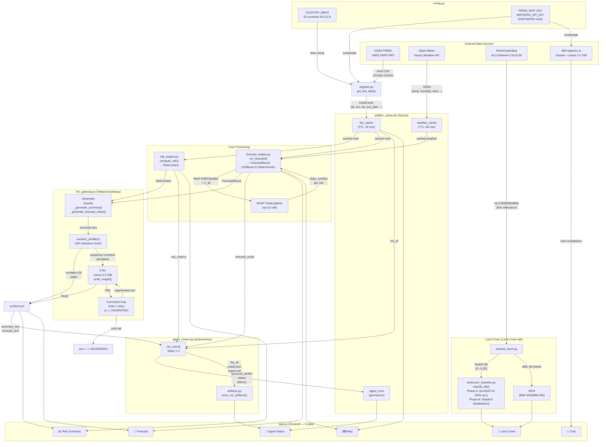

# Wildfire Dashboard AI

##  The Problem

A heat point detected by satellite (NASA FIRMS) is just a coordinate with an
intensity number attached (FRP — Fire Radiative Power). On its own, that
signal **does not support a decision**:

- Is it a real fire, or a false positive (a hot metal roof, sun glint, a
  controlled industrial burn)?
- Does it fall on vegetation with dry fuel ready to spread, or on an
  already-harvested field with no real risk?
- Is the risk going to escalate in the next 24 hours because of dry weather
  and wind, or is it going to burn out on its own?
- How do you justify to a supervisor, a board, or an insurer why resources
  were (or weren't) deployed?

Today, a local expert fills that gap with fragmented maps and personal
judgment — slow, not scalable, with no auditable record, and entirely
dependent on that person being available and awake the exact moment the
signal appears.

##  Illustrative Case — Angola

*(An illustrative usage scenario, not a measured real-world deployment.
Angola is one of the ~20 countries covered by the system, and the only one
outside Europe with a computer-vision model fine-tuned on real regional
data — see the limitations noted below.)*

### Huambo, dry season — 6:40 AM

João has patrolled this area for twelve years. He carries a folded paper map
in his shirt pocket and an old tablet that sometimes catches a signal. This
morning, the tablet shows a red dot near the river, a 40-minute drive over
dirt roads that last week's rain left worse than usual.

He doesn't know what that dot is.

It could be a real fire, spreading right now through the dense vegetation
he watched grow thick this year from early rains. Or it could be a
controlled burn some farmer lit without telling anyone, the way it happens
every week this time of year. The satellite sensor doesn't tell the
difference — it just sees heat. Nobody at the regional office can tell him
either, because they're looking at the exact same map, with no more
context than he has.

João has three people available today. If he sends someone to the red dot
and it's a controlled burn, those hours of driving, fuel, and daylight
don't come back — and if a second dot shows up this afternoon, closer to a
community, he won't have anyone free to respond. If he sends no one and it
was a real fire, in six hours it could be a kilometers-long burn scar.

He has no way to know which scenario this is. He decides with the
experience he has, which is considerable, but it isn't data — it's a
trained hunch built from years of seeing things that looked similar, not
identical to this.

He sends someone. It's a farmer's controlled burn. The man hadn't even
realized his fire had shown up on a NASA satellite.

Three hours of driving, gone. And in the afternoon, a second dot does
appear — close to a village, in an area João knows well because it holds
dense woodland, the kind of vegetation that burns fast and unforgivingly in
dry season. By the time someone arrives, it's already been burning a while.
Nobody did anything wrong — nobody simply had the information in time to
choose correctly between the two dots from that morning.

---

### The same morning, with Wildfire Dashboard AI

The red dot near the river appears on João's screen at 6:41 AM — one minute
after the satellite detected it. But this time it isn't just a dot.

Underneath, in plain language, it reads:

> *Cropland detected in this area (72% confidence). Low NDVI (0.18) —
> consistent with already-harvested cropland, not dense forest. Spread
> risk: LOW. Recommendation: monitor, low field-verification priority.*

And a second point — the one that, in the earlier story, only appeared in
the afternoon — is already visible early in the 24-hour forecast, because
the system doesn't wait for the fire to start; it computes risk per grid
cell using weather, humidity, and local fire history:

> *Risk: EXTREME. Forest_Vegetation confirmed, NDVI 0.71 (dense, likely dry
> vegetation). 24h relative humidity: 18% — the strongest contributing
> factor in this calculation. Recommendation: prioritize field
> verification.*

João doesn't have to guess between the two dots. The system already made
the comparison for him, with data, in seconds. He sends his people straight
to the second point — the one that arrived too late in the other story.
This time, they get there with daylight to spare.

The river dot, the farmer's burn, stays logged and monitored, without
spending the one mobile resource João had that morning.

---

**The difference isn't the satellite — the satellite already existed.** The
difference is that João, in the second scenario, doesn't have to decide on
a trained hunch — he decides on a verified number, generated in the time it
takes to pour a cup of coffee.

*(This is an illustrative scenario to explain the usage flow — João is a
fictional character, not a measured real-world deployment. What is real:
the land-cover classification, NDVI computation, SHAP-based risk forecast,
and AI-verified summary are built and tested capabilities using real
satellite data, documented in JUDGE.md — including their known limits.)*


##  What does it do?
Wildfire Dashboard AI is a real-time wildfire intelligence dashboard built on real satellite
Earth-observation data. It ingests live NASA FIRMS fire detections (VIIRS/MODIS),
plots them on an interactive Leaflet map with clustering (CARTO/OSM tiles) across
~20 high-risk countries, and runs a 24-hour risk forecast over a 0.25° grid using
an XGBoost classifier with SHAP explainability (with a deterministic fallback when
fire activity is too sparse for a stable model). A computer-vision pipeline —
MobileNetV2 fine-tuned on real Sentinel-2/HLS satellite imagery via NASA Earthdata —
classifies land cover (forest, cropland, water, built-up, bare, wetland) and
computes NDVI, giving every fire detection real vegetation context instead of a
bare coordinate. A generator–critic agent pair (IBM Granite generates plain-language
risk summaries; a second LLM critic audits every number against the source data
before it reaches the user) turns the raw numbers into verified, human-readable
intelligence, backed by a contextual chat layer for follow-up questions. A fully
autonomous background agent (`agent_runner.py`) can run this entire pipeline
unattended on a schedule, producing a reproducible artifact bundle — dataset,
trained model, script, and report — for every run. Built for forest rangers, civil
protection agencies, and emergency managers who need actionable fire intelligence
at a glance.

---

## How Wildfire Dashboard AI maps to the judging criteria

| Criterion | How Wildfire Dashboard AI addresses it |
|---|---|
| **1. Technical Execution** | Every component runs against real data, not mocks: live NASA FIRMS ingestion, real Sentinel-2/HLS fetches via NASA Earthdata (authenticated, with a diagnosed-and-fixed network-reliability bug — see JUDGE.md), a real XGBoost model with SHAP explainability (not a black box), and two independently trained/validated computer-vision checkpoints (93.4% EuroSAT-10, 95.6%/74.6% Global-6 EuroSAT/Angola splits) with root-cause-documented bug fixes for every misclassification found during testing. |
| **2. Innovation** | A generator–critic (Guardrails) agent pair audits every AI-generated claim against source data before it reaches the user, with a live `?debug=guardrails` mode to demonstrate the audit loop catching a fabricated number in real time. The land-cover model uses a source-aware weighted sampling strategy to correct a real domain-gap failure (African vegetation misclassified by a Europe-only model), with the resulting trade-off (v1 vs v2) documented transparently rather than hidden. |
| **3. Challenge Fit** | Built for the Space Exploration track: fire detection, vegetation context, and NDVI all come directly from satellite Earth-observation data (NASA FIRMS, Sentinel-2/HLS), applied to a real-world disaster-response problem — wildfire risk — for an actual user group (rangers, civil protection, emergency managers). |
| **4. Implementation & Feasibility** | A working, deployable Streamlit app with an interactive map, forecast, chat, and autonomous background agent mode. Every run of the autonomous agent produces a reproducible, downloadable artifact bundle (dataset + trained model + training script + report) — not just a UI demo, but auditable outputs a real operator could inspect or reuse. |

## Architecture

| Module | Role |
|---|---|
| `app.py` | Streamlit entry point — wires all modules into four tabs (Map, Risk Summary, Forecast, Chat) |
| `config.py` | Central configuration — credentials, bounding boxes, cache TTLs, and all tunable constants |
| `ingestor.py` | NASA FIRMS Area API client — fetches near-real-time fire CSV data; SQLite TTL cache |
| `weather_client.py` | Open-Meteo API client — fetches per-point hourly weather features; SQLite TTL cache |
| `risk_engine.py` | Pure-Python risk metric engine — computes `RiskContext` from fire DataFrame; no network |
| `forecast_engine.py` | Grid-cell fire probability model — builds 0.25° grid, trains `GradientBoostingClassifier` on pseudo-labels or falls back to deterministic scoring |
| `llm_gateway.py` | Abstract `LLMGateway` base class + `WatsonxGateway` concrete implementation via IBM Granite |

---

## Prerequisites

- **Python 3.10+**
- **pip** (comes with Python)
- A [NASA FIRMS Map Key](https://firms.modaps.eosdis.nasa.gov/api/area/) — free registration at NASA EOSDIS
- An [IBM watsonx.ai](https://www.ibm.com/products/watsonx-ai) account — API key and project ID required for AI features

> **No API key for Open-Meteo is needed.** It is a free, open service used for weather features.

---

## Setup

### 1. Clone or download the project

```bash
git clone <repo-url>
cd wildfire-dashboard
```

### 2. Create and activate a virtual environment

```bash
python -m venv venv
source venv/bin/activate        # macOS / Linux
# venv\Scripts\activate         # Windows
```

### 3. Install dependencies

```bash
pip install -r requirements.txt
```

> Tested with **Python 3.10, 3.11, 3.12**.

### 4. Configure environment variables

```bash
cp .env.example .env
```

Open `.env` in your editor and fill in the required values (see the [Environment Variables](#environment-variables) table below).

### 5. Run the dashboard

```bash
streamlit run app.py
```

The dashboard opens automatically in your default browser at `http://localhost:8501`.

---

## Environment Variables

| Variable | Required | Description |
|---|---|---|
| `FIRMS_MAP_KEY` | **Yes** | NASA FIRMS Area API map key. Register free at [firms.modaps.eosdis.nasa.gov/api/area/](https://firms.modaps.eosdis.nasa.gov/api/area/) |
| `WATSONX_API_KEY` | **Yes** | IBM Cloud API key for watsonx.ai authentication |
| `WATSONX_PROJECT_ID` | **Yes** | watsonx.ai project ID (find it in your project settings) |
| `WATSONX_URL` | Optional | watsonx.ai service URL. Defaults to `https://us-south.ml.cloud.ibm.com` |
| `WATSONX_MODEL_ID` | Optional | Override the default Granite model. Defaults to `ibm/granite-3-8b-instruct` |
| `LLM_BACKEND` | Optional | LLM backend selector. Currently only `watsonx` is supported. Defaults to `watsonx` |
| `CACHE_TTL_MINUTES` | Optional | TTL for the NASA FIRMS fire data SQLite cache (minutes). Defaults to `30` |
| `WEATHER_CACHE_TTL_MINUTES` | Optional | TTL for the Open-Meteo weather data SQLite cache (minutes). Defaults to `60` |
| `DEFAULT_FRP_THRESHOLD` | Optional | Default minimum Fire Radiative Power filter (MW). Defaults to `10.0` |
| `FORECAST_GRID_DEG` | Optional | Forecast grid cell size in degrees. Defaults to `0.25` (≈ 28 km at the equator) |
| `FORECAST_HISTORY_DAYS` | Optional | Days of FIRMS history used to build forecast features. Defaults to `7` |
| `DB_PATH` | Optional | Path to the SQLite cache database file. Defaults to `wildfire_cache.db` |

---

## Data Sources

| Source | Description | License |
|---|---|---|
| [NASA FIRMS](https://firms.modaps.eosdis.nasa.gov/) | Near real-time active fire and hotspot detections from VIIRS (375 m) and MODIS (1 km) satellite instruments | NASA open data / public domain |
| [Open-Meteo](https://open-meteo.com/) | Free, no-key weather forecast API — temperature, humidity, wind speed, precipitation, soil moisture (hourly, 2-day horizon) | [CC BY 4.0](https://creativecommons.org/licenses/by/4.0/) |

---

## Model Limitations

- **Probabilistic estimates only.** The 24-hour fire risk forecast outputs probabilities
  (0–100 %), not definitive predictions. Always display and interpret the results together
  with the "PROBABILISTIC ESTIMATE — NOT A CERTAINTY" disclaimer shown in the Forecast tab.
- **Pseudo-label training.** The `GradientBoostingClassifier` is trained on the same
  batch it scores, using a heuristic labelling strategy (recent fire activity = label 1;
  no activity in 7 days = label 0). This is appropriate for a prototype but is not a
  substitute for a model trained on long-term ground-truth matched labels.
- **Deterministic fallback.** When fewer than 10 labelled samples are available (e.g.,
  very few active fires in the selected country/time window), the engine falls back to
  a weighted deterministic scoring formula. The Forecast tab shows a badge indicating
  which mode was used.
- **Missing variables.** The model does not incorporate terrain slope, fuel load (NDVI),
  land cover type, or human ignition sources — all of which materially affect fire
  behaviour. Treat all outputs as decision-support aids and always consult authoritative
  local fire management agencies before making operational decisions.

---

## Phase 2 Roadmap

- **Real matched labels:** lag FIRMS data by 24 h to generate ground-truth fire/no-fire
  labels and retrain the classifier with genuine supervision.
- **NDVI / vegetation index:** integrate MODIS or Sentinel-2 vegetation greenness as a
  feature to capture fuel dryness (requires data registration — deferred to Phase 2).
- **48-hour and 7-day forecasting:** extend `ForecastResult` to support multi-horizon
  outputs; the architecture already supports this via `forecast_horizon_hours`.
- **Historical trend analysis:** add a fifth tab showing fire activity trends over 30–90
  days using FIRMS Archive data.
- **Global country coverage:** replace the hardcoded `COUNTRY_BBOX` dict with a GeoJSON
  world-bbox lookup (`geo_lookup.py`) — zero changes required in `app.py` or `ingestor.py`.
- **Push alerts / notifications:** email or webhook alerts when risk level crosses a
  configurable threshold.
- **Multi-user cloud deployment:** containerise with Docker and deploy to IBM Code Engine
  or any cloud platform; add session isolation.

---

## Capability Honesty

Each table below maps a real, wired capability to the exact file and line (or block) where a judge can verify it, plus how to observe it live.

---

<details>
<summary><strong>Detection &amp; Data</strong> — NASA FIRMS ingest, real-time fire detections, country bbox scoping</summary>

| Capability | File / lines | Live verification |
|---|---|---|
| NASA FIRMS Area API client — fetches VIIRS SNPP NRT CSV over HTTPS for a bounding-box window of 1–7 days | [`ingestor.py`](ingestor.py:29) — `FIRMS_BASE_URL`, `PRIMARY_SOURCE = "VIIRS_SNPP_NRT"` | Run dashboard → select any country → Map tab shows live fire points |
| Requests longer than 5 days are chunked into ≤5-day slices and deduplicated | [`ingestor.py`](ingestor.py:34) — `FIRMS_MAX_DAYS = 5` | Set `FORECAST_HISTORY_DAYS=7`; ingestor issues two requests automatically |
| SQLite TTL cache — avoids redundant API calls within the configured window | [`ingestor.py`](ingestor.py:58) — `fire_cache` table; TTL from `config.CACHE_TTL_MINUTES` (default 30 min) | Re-render within 30 min: no new FIRMS network call (log: "cache hit") |
| 20 high-risk countries scoped by hardcoded W,S,E,N bounding boxes | [`config.py`](config.py:113) — `COUNTRY_BBOX` dict (20 entries, Angola through Chile) | Country selector in sidebar lists all 20 countries |
| Output columns normalised to a canonical schema regardless of instrument | [`ingestor.py`](ingestor.py:37) — `OUTPUT_COLUMNS`; `_FIRMS_RENAME` maps VIIRS/MODIS band names | DataFrame always has `latitude, longitude, brightness, frp, acq_date, acq_time, confidence, instrument` |

</details>

---

<details>
<summary><strong>Forecast &amp; Explainability</strong> — XGBoost forecast engine, SHAP feature contributions, deterministic fallback</summary>

| Capability | File / lines | Live verification |
|---|---|---|
| 0.25° lat/lon grid built from country bounding box; capped at 200 cells | [`forecast_engine.py`](forecast_engine.py:49) — `MAX_GRID_CELLS = 200`; [`_build_grid()`](forecast_engine.py:126) | Forecast tab → grid overlay on map |
| XGBClassifier trained on pseudo-labels from the same 7-day FIRMS window, weather features from Open-Meteo | [`forecast_engine.py`](forecast_engine.py:591) — `clf = XGBClassifier(n_estimators=50, max_depth=2, ...)` | Forecast tab badge shows "XGBoost" when ≥10 labelled samples exist |
| Features: 5 weather columns (`temp_24h_mean`, `humidity_24h_mean`, `wind_24h_max`, `precip_24h_sum`, `soil_moisture_now`); fire history columns excluded from training to prevent trivial splits | [`forecast_engine.py`](forecast_engine.py:74) — `MODEL_FEATURE_COLS` (5 entries); exclusion rationale in docstring | Inspect feature matrix in artifact `dataset_forecast_window.csv.gz` |
| SHAP TreeExplainer runs on top-10 risk cells after XGBoost fit; each cell gets up to 5 ranked feature contributions | [`forecast_engine.py`](forecast_engine.py:436) — `_compute_shap_contribs()` | Forecast tab → expand any top-10 row → SHAP bar chart |
| Deterministic fallback when fewer than `MIN_LABELLED_SAMPLES = 10` pseudo-labels exist — weighted formula across fire count, humidity, temperature, wind, precipitation | [`forecast_engine.py`](forecast_engine.py:50) — `MIN_LABELLED_SAMPLES = 10`; [`_deterministic_score()`](forecast_engine.py:395) | Select a quiet country; Forecast tab badge shows "Deterministic" |
| 7-day FIRMS window for feature engineering fetched independently of the sidebar time-range selector | [`forecast_engine.py`](forecast_engine.py:170) — `_get_fire_window()` with module-level `_window_cache` | Set sidebar to "48 h"; forecast still uses full 7-day fire history |

</details>

---

<details>
<summary><strong>AI-Grounded Insights</strong> — Granite generator, Llama 3.3 70B critic, guardrails loop, debug mode</summary>

| Capability | File / lines | Live verification |
|---|---|---|
| IBM Granite generator (`ibm/granite-4-h-small` default, overridable via `WATSONX_MODEL_ID`) produces plain-language risk summaries and forecast interpretations | [`llm_gateway.py`](llm_gateway.py:42) — `GRANITE_MODEL_ID`; [`_generate_summary()`](llm_gateway.py:596) | Risk Summary tab → AI analysis card |
| Critic model defaults to `meta-llama/llama-3-3-70b-instruct` (configurable via `WATSONX_GUARDIAN_MODEL_ID`); classifies summaries on four failure modes: fabricated numbers, contradictions, overstated certainty, missing disclaimer | [`llm_gateway.py`](llm_gateway.py:122) — `GUARDIAN_MODEL_ID`; audit prompt at lines 124–160 | Set `?debug=guardrails` URL flag → enable test toggle → watch guardrail log output |
| Cheap numeric pre-filter: regex-extracts all numeric tokens from generated text and cross-checks against source JSON (±5% tolerance); skips LLM critic call entirely when all numbers are accounted for | [`llm_gateway.py`](llm_gateway.py:168) — `_NUM_RE`; [`numeric_prefilter()`](llm_gateway.py:203) | Pre-filter log entry "audit_insight: pre-filter PASS" visible in Streamlit logs |
| Correction loop: one regeneration attempt on FAIL; if second attempt also fails the original text is returned with `⚠ UNVERIFIED` marker | [`llm_gateway.py`](llm_gateway.py:704) — `summarize()`; UNVERIFIED_MARKER at line 58; correction at lines 746–811 | Trigger with `?debug=guardrails` flag + checkbox to inject fabricated spread value |
| `?debug=guardrails` query-param demo mode: injects the historically-fabricated spread value (1,953,840 km²) into the generator output to force the critic to FAIL and exercise the full correction pipeline | [`app.py`](app.py:184) — `if _env_force or st.query_params.get("debug") == "guardrails":`; [`llm_gateway.py`](llm_gateway.py:594) — `_DEBUG_FABRICATED_SPREAD = 1_953_840.0` | Navigate to `http://localhost:8501?debug=guardrails` → enable checkbox in sidebar |
| Shared semaphore (`threading.Semaphore(3)`) limits concurrent watsonx requests; exponential backoff on HTTP 429 | [`llm_gateway.py`](llm_gateway.py:76) — `_WATSONX_SEMAPHORE`; `_RETRY_DELAYS = (2, 4, 8)` | Rate-limit log warnings visible when multiple tabs load simultaneously |

</details>

---

<details>
<summary><strong>Land Cover &amp; Vegetation (Sentinel-2)</strong> — Phase A EuroSAT-10, Phase B Global-6, NDVI pipeline, validated accuracy numbers</summary>

| Capability | File / lines | JUDGE.md / Live verification |
|---|---|---|
| Sentinel-2 HLS bands B2/B3/B4/B8A fetched on demand from NASA Earthdata (HLSL30 product, 30 m resolution) for any configured country | [`sentinel_fetch.py`](sentinel_fetch.py:1) — `HLSL30` product; band mapping at lines 7–12 | Land Cover tab → "Fetch Sentinel-2 tile" button |
| NDVI computed directly from satellite bands (B8A−B4)/(B8A+B4); displayed independently of classifier result as a reliable vegetation signal for any region | [`app.py`](app.py:1241) — Land Cover tab NDVI section | Land Cover tab → NDVI map renders before classifier result |
| **Phase A — EuroSAT-10**: MobileNetV2 fine-tuned on 27,000 EuroSAT images (10 classes); **validated at 94% accuracy** on 300 real EuroSAT test images (30 × 10 classes) | [`landcover_classifier.py`](landcover_classifier.py:49) — `CLASSES_EUROSAT10`; model path `models/landcover_classifier.pt` | [JUDGE.md](JUDGE.md:14) — "Validated at 94% accuracy on real EuroSAT test images" |
| Phase A p2/p98 stretch fix: HLS float32 reflectances [0, 0.25] are per-channel stretched to the full DN range before PIL conversion, preventing the original 100%-SeaLake bug | [`landcover_classifier.py`](landcover_classifier.py:16) — NORMALISATION NOTE; `eurosat10` branch | [JUDGE.md](JUDGE.md:38) — bug, fix, and verification: Angola granule → HerbaceousVegetation 63.9%, SeaLake 0.0% |
| **Phase B — Global-6**: MobileNetV2 retrained on EuroSAT (21,600 train) + Angola Sentinel-2 patches (474 train / 118 val); 6 canonical classes defined in `landcover_schema.py` | [`landcover_classifier.py`](landcover_classifier.py:54) — `CLASSES_GLOBAL6`; model path `models/global6_classifier.pt` | [JUDGE.md](JUDGE.md:229) — model file mtime, training data counts |
| Phase B source-aware WeightedRandomSampler gives Angola Forest_Vegetation/Built_up 25% of within-class gradient mass to fix tropical misclassification | [`JUDGE.md`](JUDGE.md:255) — v1 vs v2 training decision record | [JUDGE.md](JUDGE.md:300) — v2 accuracy: FV 70% (+0.60), Built_up 63% (+0.25), EuroSAT overall 95.57% |
| Phase B normalisation fix: `global6` branch clips to [0,1] then applies ImageNet Normalize directly (no p2/p98 stretch) to match training pipeline | [`landcover_classifier.py`](landcover_classifier.py:24) — NORMALISATION NOTE; `global6` branch | [JUDGE.md](JUDGE.md:165) — evidence table: training path → Forest_Vegetation 95.5%; fixed path → Forest_Vegetation 60.9% (was Built_up 100%) |
| Non-European scenes display ⚠️ Experimental badge; NDVI metric shown prominently as primary trust signal | [`app.py`](app.py:1241) — Land Cover tab | [JUDGE.md](JUDGE.md:121) — badge text and rationale |

</details>

---

<details>
<summary><strong>Autonomous Agent</strong> — Full pipeline automation, reproducible artifact bundles, SQLite run history</summary>

| Capability | File / lines | Live verification |
|---|---|---|
| `agent_runner.py` orchestrates a complete 4-step pipeline for any country: FIRMS ingest → risk metrics → XGBoost forecast → AI insights (including guardrail loop) | [`agent_runner.py`](agent_runner.py:97) — `run_once()` steps 1–4 | `python agent_runner.py --country Angola` → single cycle; exit code 0 on success |
| Loop mode: repeats the full cycle every N hours (default 3 h, configurable via `AGENT_LOOP_HOURS`) with `Ctrl-C` to stop | [`agent_runner.py`](agent_runner.py:271) — `run_loop()`; `config.py` line 64 `AGENT_LOOP_HOURS` | `python agent_runner.py --country Angola --loop` |
| `--all` flag processes all 20 countries from `config.COUNTRY_BBOX` in a single run | [`agent_runner.py`](agent_runner.py:374) — `countries = sorted(config.COUNTRY_BBOX.keys())` | `python agent_runner.py --all` |
| Reproducible artifact bundle saved to `agent_artifacts/{run_id}/` per run: `dataset.csv.gz` (48h FIRMS window), `dataset_forecast_window.csv.gz` (7-day XGBoost training input), `model.json` (trained booster or deterministic sentinel), `model_script.py`, `report.md` | [`artifacts.py`](artifacts.py:96) — `save_run_artifacts()`; file list at lines 120–145 | After a run: inspect `agent_artifacts/<run_id>/` directory |
| SQLite `agent_runs` table in `wildfire_cache.db` persists every run with run_id, country, status, risk_metrics (JSON), forecast_top10 (JSON), guardrail_verdict, latency_seconds, artifacts_dir | [`agent_store.py`](agent_store.py:53) — `_CREATE_SQL` schema; `init_schema()`, `insert_run()`, `update_run()` | Agent Status tab in the dashboard — run history table with all columns |
| Guardrail verdict (`pass` / `corrected` / `unverified` / `n/a`) recorded per run and surfaced in the Agent Status tab | [`agent_runner.py`](agent_runner.py:62) — `_classify_guardrail()`; [`agent_store.py`](agent_store.py:19) — `guardrail_verdict` column | Agent Status tab → Guardrail column in run history table |

</details>

---

## Data Flow Architecture


